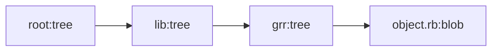

# Git Reimagined in Ruby.
Inspiration from ThoughtBot blog article [Rebuilding Git in Ruby](https://thoughtbot.com/blog/rebuilding-git-in-ruby)

## ⌨️ Supported Commands
- init
- add
- log
- commit
- checkout

## 🏗️ File Structure Overview
- `.grr/index`
  - contains the sha paths for the staged files
- `.grr/HEAD`
  - points to current branch path
- `.grr/refs/heads/BRANCH_NAME`
  - contains last commit sha
- `.grr/objects/COMMIT_SHA[0..2]/COMMIT_SHA[2..-1]`
  - contains commit information
- `.grr/objects/TREE_SHA[0..2]/TREE_SHA[2..-1]` 
  - contains next tree or blob sha
- `.grr/objects/BLOB_SHA[0..2]/BLOB_SHA[2..-1]` 
  - constains Zlib blob of file

 
_committed file will have a tree hash for each folder in their path. for example `/lib/grr/object.rb` will be ⏬_

 
## 💭 Similar Projects
- Python implementation tutorial [link](https://www.leshenko.net/p/ugit/#) 
