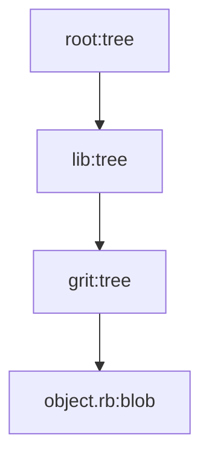

# *GRit*
Simple implementation of `git` using ruby.  Starting code and inspiration from ThoughtBot blog article [Rebuilding Git in Ruby](https://thoughtbot.com/blog/rebuilding-git-in-ruby)

## Files
- `.grit/index`
  - contains the hash locations for staged files
- `.grit/HEAD`
  - points to current branch
- `.grit/refs/heads/BRANCH_NAME`
  - contains hash of commits
- `.grit/objects/COMMIT_HASH[0..2]/COMMIT_HASH[2..-1]`
  - contains commit message and hash for root tree
- `.grit/objects/TREE_HASH[0..2]/TREE_HASH[2..-1]` 
  - contains hash for next tree hash or file blob
 
🗒️ _committed file will have a tree hash for each folder in their path. for example `/lib/grit/object.rb` will be ⏬_

 
## Additional Resources
- Python implementation tutorial [link](https://www.leshenko.net/p/ugit/#) 
